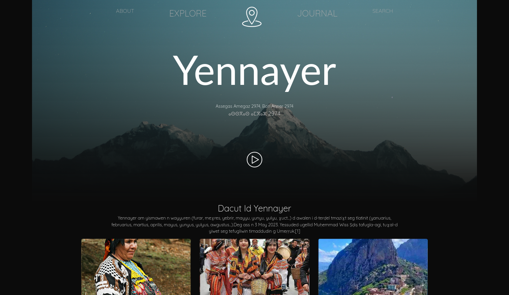

# Yennayer Celebration Website

Bienvenue sur le repository du site de célébration de Yennayer !

Ce site a été créé pour célébrer et partager la richesse culturelle de Yennayer, le Nouvel An berbère. Explorez l'histoire fascinante, découvrez les traditions familiales, plongez dans des recettes authentiques et partagez vos propres expériences dans notre espace interactif.

## Contenu

- 📖 **Histoire :** Explorez l'histoire de Yennayer et son importance culturelle.
- 🌟 **Traditions :** Découvrez des articles captivants sur les traditions familiales.
- 🍲 **Recettes :** Apprenez à préparer des plats traditionnels de Yennayer.
- 📸 **Contributions :** Partagez vos expériences et traditions dans notre espace interactif dédié aux contributeurs.

## Comment Contribuer

1. 🍴 Clonez ce repository localement.
2. 🌿 Créez une branche pour vos contributions : `git checkout -b nom-de-votre-branche`.
3. ✏️ Ajoutez vos modifications et validez-les : `git commit -m "Description de vos modifications"`.
4. 🚀 Poussez vos modifications sur votre branche : `git push origin nom-de-votre-branche`.
5. 📬 Soumettez une Pull Request.

Joignez-vous à nous dans la préservation et la célébration de Yennayer. Nous sommes impatients de voir vos contributions !

## Technologies Utilisées

Ce site a été développé en utilisant des technologies modernes telles que HTML, CSS, JavaScript, et il est basé sur le CMS WordPress pour garantir une expérience utilisateur fluide et conviviale.

## Auteur

- Dheb Areghman
- instagram : <a href="https://instagram.com?">DhebAreghman</a>
- tiktok : <a href="https://tiktok.com?">DhebAreghman</a>
- facebook : <a href="https://facebook.com??">DhebAreghman</a>

N'hésitez pas à explorer le site et à partager vos commentaires. Merci de contribuer à la préservation de la culture de Yennayer !
